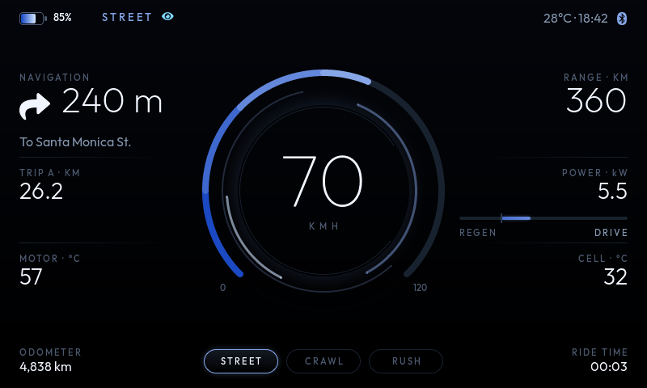
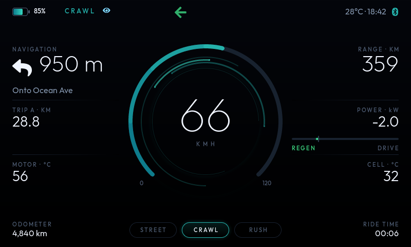
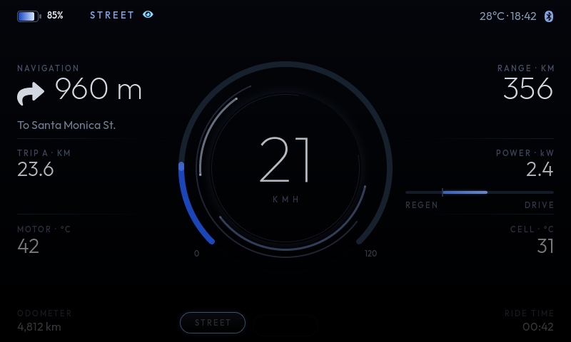
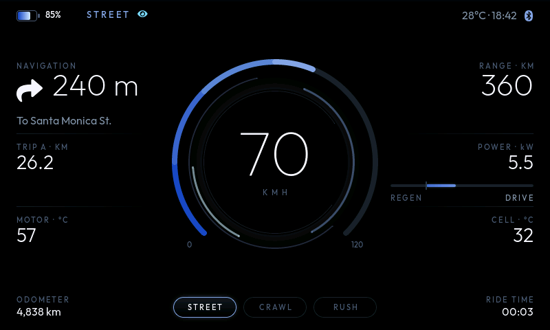

# EV Scooter Cluster — LVGL 8.3

A single-screen instrument cluster for an electric two-wheeler. Pure black
ground, one electric-blue light source, ultra-light geometric numerals, and a
halo of counter-rotating rings that never quite repeats.



STREET — the default. Blue-deep to ice along the speed ring.


RUSH — violet to pink, regenerating (`-1.8 kW`), left indicator blinking,
navigation calling a left turn in 560 m.



CRAWL — teal. 

Boot at 700 ms: ring mid-sweep, halo spinning up, footer chips still arriving.

Every image is a real frame rendered from this code, not a mockup.

- **Target:** LVGL 8.3
- **Resolution:** 800 × 480
- **Type:** Outfit (SIL OFL) at six sizes + a FontAwesome icon subset — 62.6 KB
  of flash for all eight faces. No Montserrat anywhere.

---

## What's on screen

| Region | Shows |
|---|---|
| Top strip | Drawn battery + SoC, charging bolt, ride mode, head lamp, turn indicators, ambient temp, clock, link status |
| Left column | Turn-by-turn: manoeuvre arrow, distance, street; Trip A; motor temp |
| Centre | Speed ring with gradient fill, three drifting halo rings, breathing bloom, the speed readout |
| Right column | Range; power in kW with a symmetrical regen/drive bar; cell temp |
| Footer | Odometer, STREET / CRAWL / RUSH selector, ride time |

---

## Files

```
ui/
  ui_theme.h      design tokens: palette, geometry, mode gradients
  ui_fonts.h      font declarations + FontAwesome code points
  ui_dash.h/.c    the screen, its animations, and the drivers that move it
  ui_events.c     ride-mode chip handlers
app/
  ev_data.h/.c    the vehicle boundary: ev_data_set_*() + a demo ride
fonts/
  ev_font_*.c     generated faces
  generate.sh     regenerate them from scratch
sim/
  main_win32.c    Windows 11 runner: Win32 + GDI, no SDL, no dependencies
  lv_conf.h       PC config (32-bit colour)
  build.sh        build via git bash / MSYS2
  build.bat       build via cmd
mcux/
  lv_conf.h       i.MX RT1170 config (RGB565)
  app_cluster.h/.c   the three-call seam into an SDK project
  README.md       full hardware bring-up guide
test/
  render_preview.c / raw_to_png.py / build_preview.sh
```

`ui/` knows nothing about where numbers come from; `app/` knows nothing about
how they are drawn. Swapping the demo for a real CAN feed touches one file.

---

## Running it

### On Windows 11

Plain Win32 + GDI — no SDL, no vcpkg, nothing to install but a compiler.
Get MinGW-w64 (MSYS2: `pacman -S mingw-w64-x86_64-gcc`, then put
`C:\msys64\mingw64\bin` on PATH), then:

```bat
git clone --depth 1 -b release/v8.3 https://github.com/lvgl/lvgl.git ..\lvgl_src
sim\build.bat
build\ev_cluster.exe
```

or from git bash:

```bash
LVGL_DIR=../lvgl_src bash sim/build.sh && ./build/ev_cluster.exe
```

A real 800 x 480 window opens with the cluster live in it. The ride-mode
chips are clickable.

| | |
|---|---|
| `1` `2` `3` | switch ride mode |
| `Esc` | quit |
| `--mode 2` | start in RUSH |
| `--exit-after 6000` | quit after 6 s |
| `--dump frame.bin` | write the final framebuffer (feed to `test/raw_to_png.py`) |

### On i.MX RT1170 hardware

See **[mcux/README.md](mcux/README.md)** for the full guide. The short
version: bring up a stock SDK LVGL example on the panel first, then swap
three lines.

```c
#include "app_cluster.h"

app_cluster_init();   /* instead of lv_demo_widgets()  */
app_cluster_poll();   /* instead of lv_timer_handler() */
```

Use `mcux/lv_conf.h`, and set `DEMO_PANEL` to `DEMO_PANEL_RASPI_7INCH` — the
SDK's 800 x 480 option. The UI is verified to render correctly in RGB565:



That is a real 16-bit framebuffer dump, not the 32-bit one converted.

Read the section on `LV_MEM_SIZE` before you trim it — the bloom needs a
114 KB shadow mask in one allocation, and an undersized heap hangs LVGL
rather than reporting an error.

## Live data API

All in `app/ev_data.h`. Integer only; no floating point in the render path.

```c
ev_data_set_speed(47);                       /* km/h                        */
ev_data_set_battery(86, 356);                /* SoC %, range km             */
ev_data_set_power(2400);                     /* watts, negative = regen     */
ev_data_set_temps(42, 31, 28);               /* motor, cell, ambient degC   */
ev_data_set_distance(2360, 4812);            /* trip in 0.01 km, odo in km  */
ev_data_set_nav(960, "To Santa Monica St.", EV_NAV_RIGHT);
ev_data_set_mode(EV_MODE_RUSH);
ev_data_set_turn(true, false);
ev_data_set_charging(true);
ev_data_set_beam(true);
ev_data_set_clock(18, 42);
ev_data_set_ride_time(2520);
```

Conditional styling lives in the setters, not the layout: the battery leaves
the mode accent and warns amber below 20 % / red below 10 %, the power bar
flips green under regen, motor temp turns amber at 90 °C, and the navigation
arrow lights up inside 120 m of the manoeuvre.

`ev_data_set_nav()` switches from metres to `x.y km` above 1000 m, the way
every nav app does. Pass 0 metres to clear guidance.

---

## Design notes

**No panels.** Everything floats on black. The only structure is two hairlines
per column, which fade *away from the centre* so the eye stays on the dial.
Units live in the caption (`RANGE · KM`) rather than beside the number, which
keeps the numerals a clean right-aligned column.

**The gradient ring.** LVGL 8 arcs are a single colour, so the fill is
`EV_ARC_SEGMENTS` (6) abutting arcs sharing one geometry, each covering 45° of
the 270° sweep with its own indicator colour. Rounded caps hide the joins. One
animation callback drives the ring value, all six segments and the numeral, so
they can never disagree.

**The halo.** Three arcs of partial span at 26 s, 19 s and 34 s — deliberately
incommensurate periods, so the picture never repeats — plus a short bright
crest at 11 s. Rotation is `lv_arc_set_rotation()`, which is far cheaper than
redrawing anything. The crest is held dimmer than the speed arc on purpose: it
is atmosphere, and must never be misread as the value.

**The bloom** is two circles with no fill whose shadow is the only thing drawn,
one of them breathing its blur radius between 48 and 88 px.

**Typography.** Outfit Thin at 92 px for the speed, ExtraLight 44 for the two
hero values, Light 28 for secondary, Medium 11/13 with wide letter-spacing for
captions. The big faces carry only the glyphs they need, which is why a 92 px
font costs 13 KB.

---

## Animations

| What | Where |
|---|---|
| Staggered fade + 12–14 px rise, chrome → light → columns → footer | `ev_dash_boot()` |
| Halo spin-up: two fast decelerating turns landing back at 0° | `ev_dash_boot()` |
| Endless halo drift at four incommensurate periods | `ev_dash_halo_drift()` |
| Middle ring breathes its opacity; bloom breathes its blur, out of phase | `ev_dash_halo_drift()` |
| Full-scale needle sweep 0 → 120 → 0 | `ev_dash_boot()` |
| Speed eases into place over 220 ms | `ev_dash_anim_speed()` |
| Turn-indicator blink | `blink_set()` in `ev_data.c` |

The demo holds still for the first 2.6 s (`EV_BOOT_HOLD_MS`) so the power-on
sequence plays cleanly before live values start moving. A one-shot timer hands
the halo from spin-up to drift at 2.45 s.

---

## Headless preview (screenshots, CI)

Separate from the Windows app: this one opens no window at all, renders to
memory for a fixed number of milliseconds and writes a PNG. Useful for
grabbing a frame at an exact moment, or for checking the UI in CI.

```bash
LVGL_DIR=../lvgl_src bash test/build_preview.sh 6000 0
```

Arguments are milliseconds to run and ride mode (`0` STREET, `1` CRAWL,
`2` RUSH). Output lands in `build/preview.png`. Pass `700` to catch the boot
sequence mid-flight.

To render exactly what the hardware will show, point it at the RT1170 config
— `test/raw_to_png.py` detects RGB565 from the dump size:

```bash
CONF_DIR=mcux OUT=build565 LVGL_DIR=../lvgl_src bash test/build_preview.sh 6000 0
```

## Regenerating the fonts

```bash
bash fonts/generate.sh
```

Fetches the Outfit weights and re-runs `lv_font_conv` (via `npx`, so nothing
is installed globally). Change the family or sizes at the top of that script;
keep the FontAwesome code point list in step with `ui/ui_fonts.h`.

---

## Tuning

**Colours and geometry** are all in `ui/ui_theme.h`. The per-mode ring
gradients are `EV_STREET_FROM`/`_TO`, `EV_CRAWL_*`, `EV_RUSH_*`; the midpoint
of the active pair becomes the accent for the halo, bloom, battery, chip and
link icon.

**Redraw cost.** The heavy items are the seven overlapping ~300 px arcs and
the two shadow blooms. If frame rate is tight:

- drop `EV_ARC_SEGMENTS` to 1 for a flat single-colour ring (−5 arcs)
- drop the halo to one ring, or raise the drift periods
- set `shadow_width` to 0 on `glow_out` / `glow_in`

All are style-only changes; no layout moves.

**Another resolution.** Positions are absolute. `EV_W/EV_H`, `EV_MARGIN`,
`EV_COL_W`, `EV_DIAL_CX/CY` and `EV_ARC_SIZE` are the values to start from.
For a short panel like 480 × 272, move the two columns under the dial rather
than scaling — the type is already at its comfortable minimum.

---

## A note on GUI Guider

The first version of this screen was built to be mirrored in GUI Guider. This
one is not, by request: the rotating halo, the multi-segment gradient ring, the
custom typefaces and the shadow blooms are all things the editor cannot
author. The code is plain LVGL 8.3 with no dependencies beyond `lvgl.h`, so it
drops into an MCUXpresso project alongside GUI Guider output — it just is not
editable *from* the editor. If you need a screen the design team can move
widgets around in, keep that one for the editable screens and treat this as
hand-built.
